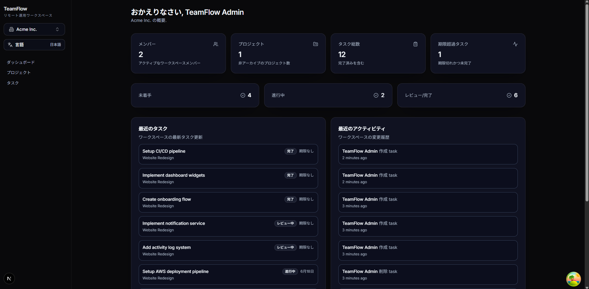
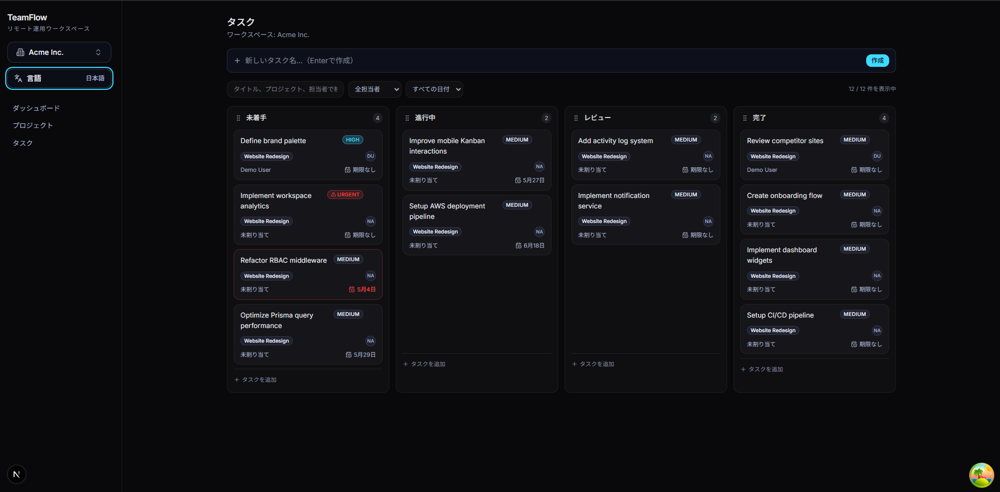
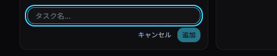
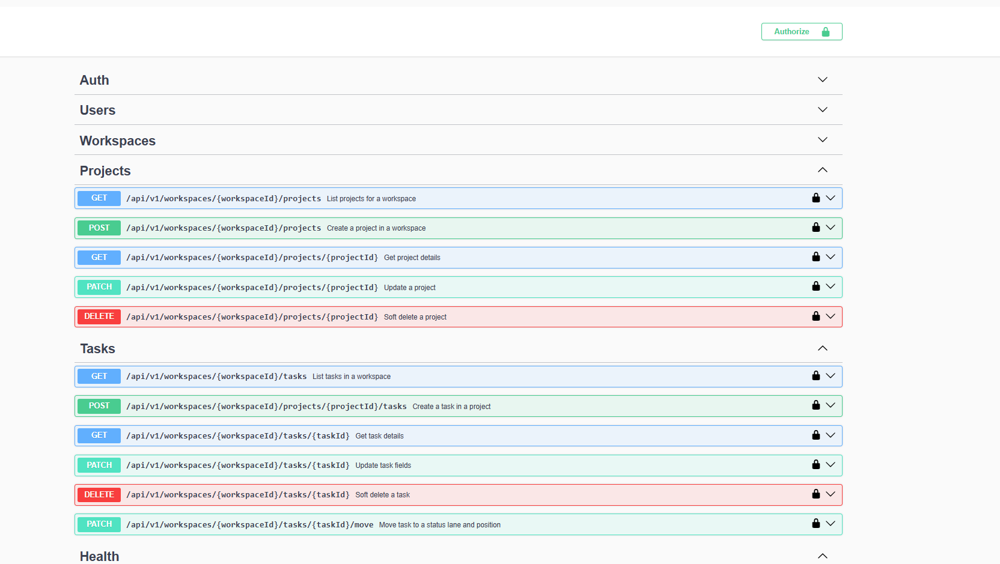

===== README.md START =====
## Live Demo

Frontend:
https://teamflow-saas-platform-web-txwz.vercel.app

# TeamFlow

プロダクションレベルのフルスタックSaaS型タスク・プロジェクト管理プラットフォームです。

Next.js / NestJS / Prisma / PostgreSQL をベースに、
モダンなKanban UX、RBAC認可、Swagger APIドキュメント、Workspaceベースのマルチテナント構成を実装しています。

---

## Dashboard Overview

WorkspaceベースのSaaSダッシュボード。

- タスク統計
- Recent Activity
- Recent Tasks
- Workspace Summary
- Responsive SaaS UI



---

## 主な機能

- Workspaceベースのマルチテナント構成
- Kanbanタスク管理
- Drag & Drop対応
- Inline Quick Create UX
- JWT認証
- Role-Based Access Control (RBAC)
- Swagger/OpenAPI ドキュメント
- React Queryによるキャッシュ管理
- Prisma ORM
- PostgreSQL
- AWSデプロイ対応設計
- モバイル対応レスポンシブUI

---

## 技術スタック

### Frontend

- Next.js 15
- React
- TypeScript
- Tailwind CSS
- shadcn/ui
- React Query
- Zustand

### Backend

- NestJS
- Prisma
- PostgreSQL
- JWT Authentication
- Swagger/OpenAPI
- Zod Validation

### Infrastructure

- Docker
- AWS Ready Architecture
- GitHub Actions
- pnpm Workspace
- TurboRepo

---

## Kanban Board

モダンSaaSスタイルのKanban UIを実装。

### 主な特徴

- Drag & Drop
- Optimistic Updates
- Inline Task Creation
- Keyboard Accessible DnD
- Mobile Friendly UX



---

## Quick Create UX

Linear / Jira スタイルの高速タスク作成UX。



---

## Swagger API Documentation

NestJS + Swagger によるREST APIドキュメント。

### API Features

- JWT Authentication
- Typed Request / Response Schema
- Workspace-scoped API Design
- RBAC Protected Endpoints



---

## アーキテクチャ

```text
apps/
 ├── web      → Next.js Frontend
 └── api      → NestJS Backend

packages/
 ├── shared   → shared types/schemas
```

---

## ローカル実行

### 1. Install dependencies

```bash
pnpm install
```

### 2. Start PostgreSQL

```bash
docker compose -f docker/docker-compose.dev.yml up -d
```

### 3. Setup environment variables

```bash
cp apps/api/.env.example apps/api/.env
cp apps/web/.env.example apps/web/.env.local
```

### 4. Prisma setup

```bash
pnpm --filter @teamflow/api prisma:generate
pnpm --filter @teamflow/api prisma:migrate
pnpm --filter @teamflow/api prisma:seed
```

### 5. Run development server

```bash
pnpm dev
```

---

## API Documentation

```text
http://localhost:4000/api/docs
```

---

## Demo Account

```text
Email: admin@teamflow.dev
Password: Admin@1234
```

---

## Roadmap

- File Upload (S3)
- Realtime Notifications
- Activity Logs
- Analytics Dashboard
- AWS ECS Deployment
- Terraform Infrastructure

---

## Author

石川美菜 (Ishikawa Mina)

Fullstack Engineer
Japan

===== README.md END =====